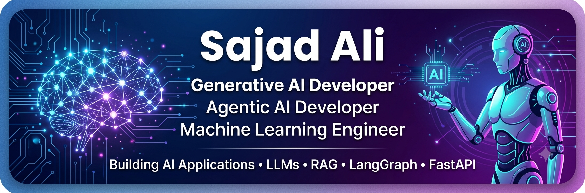

  

  

 

  

  
  
  
  

  

---

# Hey, I'm Sajad Ali 👋

## 🚀 Generative AI Developer | Agentic AI Developer | Machine Learning Engineer

I'm a BS Information Technology student passionate about building intelligent AI applications using **Large Language Models (LLMs)**, **AI Agents**, and **Retrieval-Augmented Generation (RAG)**. I enjoy transforming AI ideas into practical, production-ready applications that solve real-world problems.

My primary interests include **Generative AI, Agentic AI, Multi-Agent Systems, Machine Learning, and AI Automation.**

---

## 🛠 Tech Stack

---

## 🧠 AI & Generative AI Skills

- Generative AI
- Agentic AI
- Large Language Models (LLMs)
- AI Agents
- Multi-Agent Systems
- Retrieval-Augmented Generation (RAG)
- Prompt Engineering
- AI Automation

---

## 🤖 Machine Learning

- Machine Learning
- Deep Learning
- Natural Language Processing (NLP)
- Data Analysis

---

## ⚙️ Frameworks & Libraries

- LangChain
- LangGraph
- FastAPI
- Flask
- Streamlit
- Transformers (Hugging Face)
- FAISS
- ChromaDB

---

## 💻 Programming Languages

- Python
- SQL
- HTML
- CSS
- JavaScript

---

## 🔌 APIs & AI Models

- Google Gemini API
- OpenAI API
- Groq API

---

## 🛠 Development Tools

- Git
- GitHub
- VS Code
- Jupyter Notebook
- Postman

---

## 🚀 Featured Projects

### 🤖 RAG AI Document Assistant
A Retrieval-Augmented Generation chatbot that answers questions from PDF documents using LangChain, FAISS, and Google Gemini.

### 🔍 LangChain Multi-Agent Research System
A multi-agent research assistant built with LangGraph that performs intelligent web research using multiple AI agents.

### 🎙 Smart AI Voice Assistant
A voice-enabled AI assistant capable of speech recognition and intelligent responses.

### 📄 AI Resume Analyzer
An AI-powered resume analysis system that provides intelligent feedback using LLMs.

### 📝 AI MCQs Generator
Automatically generates multiple-choice questions from educational content using Generative AI.

### 💬 AI Chatbot
A conversational AI chatbot built using FastAPI/Flask and modern LLMs.

---

## 💼 Internship Experience

- AI Intern — DevSphere
- Generative AI Intern — Arch Technologies
- Generative AI Intern — DecodeLabs
- AI & Data Science Intern — DevelopersHub Corporation
- AI Intern — Technify

---

## 📚 Currently Learning

- Agentic AI
- LangGraph Advanced Workflows
- MLOps
- Docker
- Cloud Deployment
- LangSmith
- AI Observability
- Production AI Systems

---

## 🎯 Career Interests

I'm interested in opportunities related to:

- Generative AI
- Agentic AI
- AI Engineering
- Machine Learning Engineering
- LLM Applications
- RAG Systems
- AI Automation
- Backend AI Development

---

## 🌱 Career Goal

To become a professional AI Engineer by building scalable AI products, contributing to open-source projects, and solving real-world problems with Artificial Intelligence.

---

## 📫 Connect With Me

📧 **Email:** <sajadali.tech@gmail.com>
💼 **LinkedIn:** https://linkedin.com/in/sajad-ali-a3074b352
💻 **GitHub:** https://github.com/SajadaliAI
🎯 **Fiverr:** https://www.fiverr.com/sajad_tech

## 📊 GitHub Statistics

  
    
  
    
  

---

## 🏆 GitHub Trophies

  

---

## 📈 Contribution Graph

  

---

## 🐍 Contribution Snake

> Note: Snake Animation tab dikhegi jab aap iska GitHub Action setup karenge, filhal graph aur stats perfectly load hone lagenge.

## 💡 Quote

> "The best way to predict the future is to build it with AI."

⭐ *If you like my work, consider giving a star to my repositories.*
